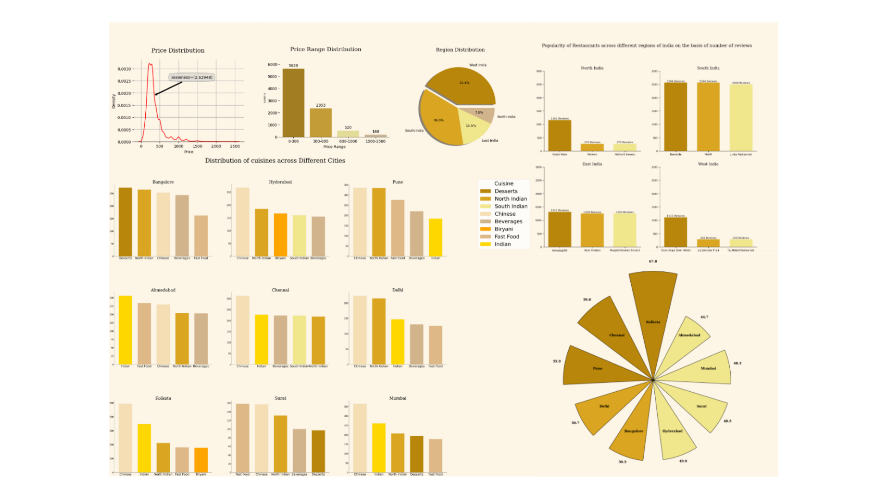

# Swiggy EDA

## Problem Statement
With the rapid growth of online food delivery platforms, understanding customer preferences and restaurant performance has become crucial for data-driven decision making. Swiggy, one of India’s leading food delivery platforms, generates large volumes of data related to restaurants, cuisines, pricing, ratings, and delivery patterns.

## Introduction
This Exploratory Data Analysis (EDA) project focuses on analyzing the Swiggy dataset to uncover meaningful insights, trends, and patterns within the food delivery ecosystem. By examining factors such as restaurant ratings, price ranges, cuisine types, and location-based availability, this analysis aims to better understand customer behavior and market dynamics.

## Description: 
This data set is [swiggy-restuarant-dataset](https://www.kaggle.com/datasets/abhijitdahatonde/swiggy-restuarant-dataset) from Kaggle.This dataset provides valuable information about various aspects of restaurants, enabling users to explore, analyze, and gain insights into the restaurant landscape on Swiggy.

## Univariate Analysis
### 1.Price Distribution by using KDE Plot
Analyzing the price distribution of restaurants provides valuable insights into customer affordability patterns, enabling Swiggy to optimize pricing strategies, enhance restaurant recommendations, and better align promotional offers with the spending capacity of its diverse user base

### 2.Price Range Distribution by using Countplot
Studying the distribution of restaurant price ranges in the Swiggy dataset helps identify the most common affordability segments, allowing Swiggy to tailor its offerings, balance restaurant partnerships across budget-friendly and premium categories, and design targeted marketing campaigns for different customer groups

### 3.Region Distribution by using Countplot
Analyzing the region-wise distribution of restaurants in the Swiggy dataset reveals geographic concentration and market penetration, which helps Swiggy identify high-demand areas, strengthen delivery networks, and strategically expand into underrepresented regions.

## Bivariate Analysis
### 4.Analysis of City and Price Range using Heatmap
Examining the distribution of restaurant price ranges across different cities highlights variations in customer affordability and dining preferences, enabling Swiggy to customize pricing strategies, partner with restaurants that match local demand, and design city-specific promotional campaigns.

### 5.Analysis between City and Delivery Time using Polar Bar plot
A detailed analysis of delivery time distribution across cities in the Swiggy not only reveals differences in average delivery durations but also uncovers hidden patterns influenced by factors such as restaurant density, traffic congestion, urban infrastructure, and peak order hours. These insights allow Swiggy to identify cities facing consistent delivery delays, benchmark performance against faster cities, and implement targeted operational improvements such as dynamic rider allocation, optimized restaurant clustering, and AI-driven route planning. By leveraging this city-wise delivery performance data, Swiggy can enhance service reliability, reduce waiting times, and ultimately strengthen customer trust and loyalty.

### 6.Analysis between Cuisines across Different Cities
Analyzing the distribution of cuisines across different cities in the Swiggy dataset provides critical insights into regional food preferences and cultural eating habits.This analysis helps Swiggy identify cities where certain cuisines dominate, detect emerging food trends, and recognize gaps in cuisine availability. For example, some cities may show a higher demand for global cuisines such as Italian or Chinese, while others exhibit stronger preferences for traditional Indian cuisines. By understanding these city-wise cuisine patterns, Swiggy can strengthen restaurant partnerships, expand offerings in underserved cuisine categories, and design hyper-localized marketing campaigns that align with customer taste profiles, thereby improving both customer satisfaction and business growth.

### 7.Analysis between Popularity of Restaurants across different regions of india on the basis of number of reviews
Examining the top three restaurants across different regions of India based on the number of reviews in the Swiggy provides valuable insights into customer engagement and restaurant popularity. A high volume of reviews often reflects not only strong customer interest but also higher order frequency and greater brand visibility within that region. By comparing these top performers region-wise, Swiggy can identify benchmark restaurants that set service or quality standards, recognize regional differences in customer preferences, and highlight potential models for restaurant success. These insights enable Swiggy to strengthen partnerships with high-performing outlets, support emerging restaurants in replicating best practices, and refine region-specific strategies to maximize customer satisfaction and platform growth.

